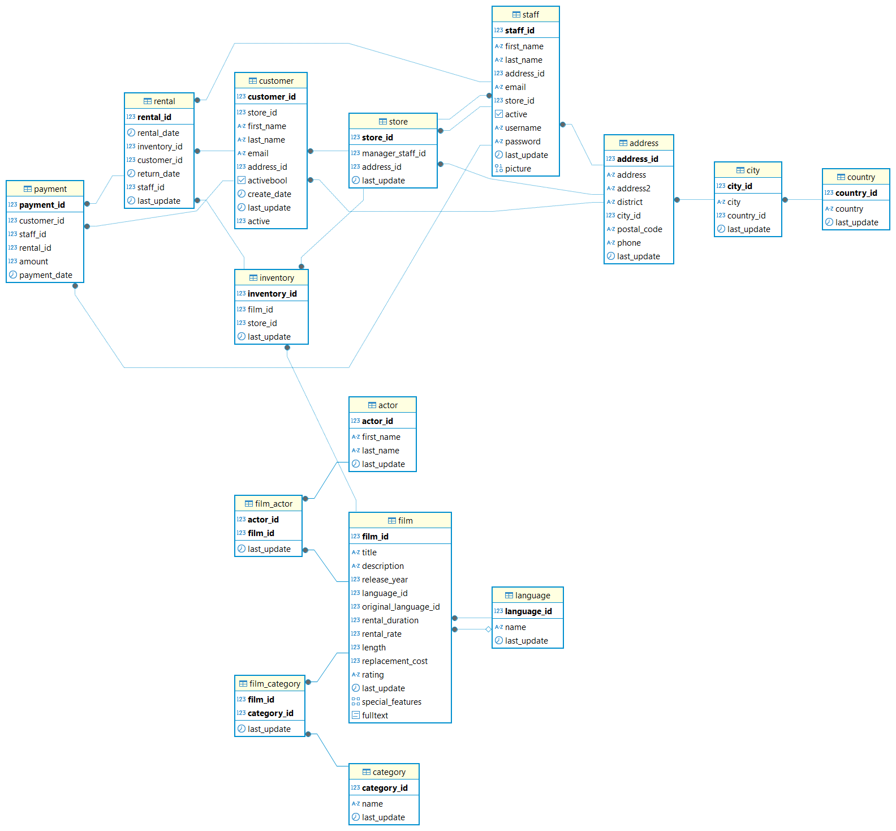

# DataProject: Lógica. Consultas de SQL
Proyecto 2 - Curso Data Analytics V3

En este proyecto se aplican los conocimientos aprendidos en el módulo "SQL".   
las consultas siguientes se hacen a traves de Dbeaver.

## Estructora del repositorio ##

```bash 
|
|___BBDD_SQL_proyecto2
|    |___BBDD_Proyecto #archivo BBDD SQL
|    |___Diagram_Proyecto_BBDD #imagen.png del diagrama 
|    |___EnunciadoDataProject_SQL.Lógica #lista de consultas a realizar
|    |___README
|    |___script-consultas_proyecto_2 #script SQL de respuestas   
|


```

## Consultas ##

**1. Crea el esquema de la BBDD**  




 **2. Muestra los nombres de todas las películas con una clasificación por 
edades de ‘Rʼ**

``` 
SELECT "title",
        "rating"
FROM "film" 
WHERE "rating" = 'R';
```

 **3. Encuentra los nombres de los actores que tengan un “actor_idˮ entre 30 
y 40** 
```
SELECT concat(first_name,' ',last_name )
FROM actor 
WHERE actor_id <= 40 AND actor_id >= 30;
```


 **4. Obtén las películas cuyo idioma coincide con el idioma original**  

Todos los valores de la columna original_language_id son nulos por lo cual no se muestra ningun resultado.

```
SELECT title 
FROM film 
WHERE language_id = original_language_id 
    AND original_language_id IS NOT NULL ;`
```


**5. Ordena las películas por duración de forma ascendente**  
```
SELECT  title , length 
FROM    film
ORDER BY length ASC ;
```

 **6. Encuentra el nombre y apellido de los actores que tengan ‘Allenʼ en su 
apellido**


```
SELECT first_name , last_name 
FROM actor 
WHERE last_name ILIKE 'Allen';
```


**7. Encuentra la cantidad total de películas en cada clasificación de la tabla 
“filmˮ y muestra la clasificación junto con el recuento**

```
SELECT rating, COUNT(*) AS total_peliculas
FROM film
GROUP BY rating;
```

 **8. Encuentra el título de todas las películas que son ‘PG-13ʼ o tienen una 
duración mayor a 3 horas en la tabla film**

```
SELECT title, length, rating  
FROM   film
WHERE  rating = 'PG-13'
    OR length > 180;
```


 **9. Encuentra la variabilidad de lo que costaría reemplazar las películas**

```
SELECT VAR_SAMP(replacement_cost)  AS variabilidad
FROM film ;
```

 **10. Encuentra la mayor y menor duración de una película de nuestra BBDD**

```
SELECT max(length ) AS mayor_duracion, min(length ) AS menor_duracion
FROM film ;
```

 **11. Encuentra lo que costó el antepenúltimo alquiler ordenado por día**  

```
SELECT amount  
FROM payment 
ORDER BY payment_date DESC 
LIMIT 1 OFFSET 1;
```


**12. Encuentra el título de las películas en la tabla “filmˮ que no sean ni ‘NC-
 17ʼ ni ‘Gʼ en cuanto a su clasificación**

```
SELECT title 
FROM film   
WHERE rating NOT IN('NC-17','G');
```

**13. Encuentra el promedio de duración de las películas para cada 
clasificación de la tabla film y muestra la clasificación junto con el 
promedio de duración**

``` 
SELECT  rating, round(AVG(length),0) AS "promedio_duracion_peliculas"
FROM    film
GROUP BY rating ;
```


 **14. Encuentra el título de todas las películas que tengan una duración mayor 
a 180 minutos**

```
SELECT  title, length 
FROM    film
WHERE    length >= '180';

```   


**15. ¿Cuánto dinero ha generado en total la empresa?**

```
SELECT SUM(amount ) AS "total_ingresos"
FROM payment ;

```


**16. Muestra los 10 clientes con mayor valor de id**

``` 
SELECT customer_id , first_name , last_name 
FROM customer 
ORDER BY customer_id DESC
    LIMIT 10;

```

 **17. Encuentra el nombre y apellido de los actores que aparecen en la 
película con título ‘Egg Igbyʼ**

```
SELECT first_name , last_name 
FROM actor  AS a
INNER JOIN film_actor  AS fa ON a.actor_id = fa.actor_id
INNER JOIN film AS f ON fa.film_id = f.film_id 
WHERE f.title ILIKE 'egg igby';

```


**18. Selecciona todos los nombres de las películas únicos** 

```
SELECT DISTINCT title 
FROM film;
```


**19. Encuentra el título de las películas que son comedias y tienen una 
duración mayor a 180 minutos en la tabla “filmˮ**

```
SELECT title 
FROM film AS f 
INNER JOIN film_category AS fc ON f.film_id = fc.film_id
INNER JOIN category AS c ON c.category_id = fc.category_id
WHERE f.length >= 180 AND c."name" ILIKE 'comedy';
```  


**20. Encuentra las categorías de películas que tienen un promedio de duración superior a 110 minutos y muestra el nombre de la categoría junto con el promedio de duración**  

``` 
SELECT c.name AS categoria, ROUND(AVG(f.length),2) AS promedio_duracion
FROM film f
JOIN film_category fc ON f.film_id = fc.film_id
JOIN category c ON fc.category_id = c.category_id
GROUP BY c.name
HAVING ROUND(AVG(f.length ), 2) > 110;

```

**21. ¿Cuál es la media de duración del alquiler de las películas?**

```
SELECT AVG((return_date - rental_date)) AS duracion_media_alquiler
FROM rental ;
```


**22. Crea una columna con el nombre y apellidos de todos los actores y 
actrices**

```
SELECT concat(first_name , ' ', last_name )
FROM actor
GROUP BY actor_id 
ORDER BY last_name ASC ;
```


**23. Números de alquiler por día, ordenados por cantidad de alquiler de 
forma descendente**

```
SELECT CAST(rental_date AS DATE) AS fecha_alquiler, COUNT(rental_id) AS cantidad_alquiler_dia
FROM rental 
GROUP BY CAST(rental_date AS DATE)
ORDER BY cantidad_alquiler_dia DESC;
```

 **24. Encuentra las películas con una duración superior al promedio**

 ``` 
SELECT title 
FROM film
WHERE length > (SELECT AVG(length)
                FROM film);
```


**25. Averigua el número de alquileres registrados por mes**

```
SELECT date_part('month', rental_date ) AS mes,
        COUNT(rental_id) AS Total_alquileres
FROM rental
GROUP BY mes 
ORDER BY mes ;
```

**26. Encuentra el promedio, la desviación estándar y varianza del total 
pagado**

```
SELECT AVG(amount ) AS promedio,
        stddev(amount ) AS Desviacion_estandar,
        variance(amount) AS varianza        
FROM payment AS p ;

```
**27  ¿Qué películas se alquilan por encima del precio medio?**

```
SELECT title AS titulo , rental_rate AS precio_alquiler ,
        (SELECT AVG(rental_rate)FROM film) AS promedio_precio_alquiler
FROM film AS f 
WHERE rental_rate  > 
        (SELECT AVG(rental_rate )
        FROM film);
```

 **28. Muestra el id de los actores que hayan participado en más de 40 
películas**

```
SELECT actor_id, COUNT(film_id ) AS numero_peliculas
FROM film_actor AS fa 
GROUP BY actor_id  
HAVING COUNT(film_id) > 40 ;
```

**29. Obtener todas las películas y, si están disponibles en el inventario, 
mostrar la cantidad disponible**

```
SELECT f.title, COUNT(f.film_id ) AS cantidad_disponible
FROM film AS f  
RIGHT JOIN inventory AS i ON i.film_id = f.film_id
GROUP BY f.title
HAVING COUNT(f.film_id) > 0
ORDER BY cantidad_disponible ASC
```

**30. Obtener los actores y el número de películas en las que ha actuado**

```
SELECT  CONCAT(a.first_name, ' ', a.last_name) AS Actor, 
        COUNT(fa.film_id) AS numero_peliculas
FROM film_actor AS fa 
JOIN actor AS a ON a.actor_id = fa.actor_id
GROUP BY a.actor_id, actor 
ORDER BY numero_peliculas DESC ;
```


**31. Obtener todas las películas y mostrar los actores que han actuado en 
ellas, incluso si algunas películas no tienen actores asociados**

```
SELECT f.title, CONCAT(a.first_name, ' ', a.last_name) AS nombre_actor
FROM film AS f 
LEFT JOIN film_actor AS fa ON fa.film_id = f.film_id
LEFT JOIN actor AS a ON a.actor_id = fa.actor_id 
ORDER BY f.title;
```

**32. Obtener todos los actores y mostrar las películas en las que han 
actuado, incluso si algunos actores no han actuado en ninguna película**

```
SELECT concat(a.first_name, ' ', a.last_name) AS nombre_actor, title AS pelicula
FROM actor AS a 
LEFT JOIN film_actor AS fa ON fa.actor_id = a.actor_id
LEFT JOIN film AS f ON fa.film_id =f.film_id
ORDER BY nombre_actor ASC ;
```

 **33. Obtener todas las películas que tenemos y todos los registros de 
alquiler**

```
SELECT f.title, i.inventory_id, r.rental_date
FROM inventory AS i 
FULL JOIN film AS f ON i.film_id = f.film_id 
FULL JOIN rental AS r ON i.inventory_id = r.inventory_id
ORDER BY f.title ASC ;
```

**34. Encuentra los 5 clientes que más dinero se hayan gastado con nosotros**

SELECT concat(c.first_name, ' ',c.last_name ) AS cliente, 
        sum(p.amount) total_gastado
FROM payment AS p 
LEFT JOIN customer AS c ON c.customer_id = p.customer_id
GROUP BY cliente 
ORDER BY total_gastado DESC
LIMIT 5;

 **35. Selecciona todos los actores cuyo primer nombre es 'Johnny'**

```
SELECT concat(a.first_name, ' ', a.last_name) AS actor
FROM actor AS a 
WHERE a.first_name ILIKE('johnny');
```

 **36. Renombra la columna “first_nameˮ como Nombre y “last_nameˮ como 
Apellido**

```
SELECT a.first_name AS "Nombre", a.last_name AS "Apellido"
FROM actor AS a 
ORDER BY "Nombre" ASC;
```

**37. Encuentra el ID del actor más bajo y más alto en la tabla actor**

```
SELECT MIN(a.actor_id), MAX(a.actor_id)
FROM actor AS a ;
```

**38. Cuenta cuántos actores hay en la tabla “actorˮ**

```
SELECT count(a.actor_id) 
FROM actor AS a ;
```


**39. Selecciona todos los actores y ordénalos por apellido en orden 
ascendente**
```
SELECT a.first_name, a.last_name
FROM actor AS a 
ORDER BY a.last_name ASC;
```


**40. Selecciona las primeras 5 películas de la tabla “filmˮ**

``` 

SELECT f.title 
FROM film AS f 
LIMIT 5;
```

**41. Agrupa los actores por su nombre y cuenta cuántos actores tienen el 
mismo nombre. ¿Cuál es el nombre más repetido?**

```
SELECT a.first_name AS nombre, COUNT(a.first_name) AS repetido 
FROM actor AS a 
GROUP BY nombre
ORDER BY repetido DESC;
```


**42. Encuentra todos los alquileres y los nombres de los clientes que los 
realizaron**

```
SELECT r.rental_id, concat(c.first_name, ' ', c.last_name)
FROM rental AS r 
LEFT JOIN customer AS c ON c.customer_id = r.customer_id;
```

**43.Muestra todos los clientes y sus alquileres si existen, incluyendo 
aquellos que no tienen alquileres**

```
SELECT c.customer_id, c.first_name, c.last_name, r.*
FROM customer AS c 
LEFT JOIN rental AS r ON c.customer_id = r.customer_id
ORDER BY c.customer_id, r.rental_date ASC;
```


**44. Realiza un CROSS JOIN entre las tablas film y category. ¿Aporta valor 
esta consulta? ¿Por qué? Deja después de la consulta la contestación.**

```
SELECT *
FROM film AS f 
CROSS JOIN category AS c ;
```
La consulta no aporta valor ya que no hay primary key y foreign key en commun, se tendria que añadir un join a la tabla film_category para tener una relacion de tablas util


**45. Encuentra los actores que han participado en películas de la categoría 
'Action'**

```SELECT a.first_name , a.last_name, c."name" 
FROM actor AS a 
LEFT JOIN film_actor AS fa ON fa.actor_id = a.actor_id
LEFT JOIN film AS f ON f.film_id = fa.film_id
LEFT JOIN film_category AS fc ON fc.film_id  = fa.film_id 
LEFT JOIN category AS c ON c.category_id = fc.category_id
WHERE c."name" ILIKE 'action';
```

**46. Encuentra todos los actores que no han participado en películas**

```
SELECT a.actor_id  
FROM actor AS a 
LEFT JOIN film_actor AS fa  ON fa.actor_id = a.actor_id
WHERE fa.film_id IS NULL ;
```

**47. Selecciona el nombre de los actores y la cantidad de películas en las 
que han participado**

```
SELECT a.first_name, COUNT(film_id ) AS cantidad_peliculas
FROM actor AS a 
LEFT JOIN film_actor AS fa ON fa.actor_id = a.actor_id
GROUP BY a.actor_id 
ORDER BY first_name ;

```

**48. Crea una vista llamada “actor_num_peliculasˮ que muestre los nombres 
de los actores y el número de películas en las que han participado**

```
CREATE VIEW actor_num_peliculas AS 
SELECT concat(a.first_name,' ', a.last_name) AS nombre_cliente, COUNT(film_id ) AS cantidad_peliculas
FROM actor AS a 
LEFT JOIN film_actor AS fa ON fa.actor_id = a.actor_id
GROUP BY a.actor_id 
ORDER BY first_name ;
```


**49. Calcula el número total de alquileres realizados por cada cliente** 

``` 
SELECT r.customer_id, COUNT(r.rental_id)
FROM rental AS r 
GROUP BY r.customer_id
ORDER BY r.customer_id;
```


 **50. Calcula la duración total de las películas en la categoría 'Action'**

```
SELECT SUM(f.length) AS duracion_total
FROM film AS f   
LEFT JOIN film_category AS fc ON fc.film_id = f.film_id
LEFT JOIN category AS c ON c.category_id = fc.category_id
WHERE c."name" = 'Action' ;
```


**51. Crea una tabla temporal llamada “cliente_rentas_temporalˮ para 
almacenar el total de alquileres por cliente** 

```
CREATE TEMPORARY TABLE cliente_rentas_temporal (
    "cliente" INT,
    "total_alquiler" INT);

INSERT INTO cliente_rentas_temporal (cliente, total_alquiler)
SELECT r.customer_id, COUNT(r.rental_id)
FROM rental AS r 
GROUP BY r.customer_id;

SELECT *
FROM cliente_rentas_temporal;
```


**52. Crea una tabla temporal llamada “peliculas_alquiladasˮ que almacene las 
películas que han sido alquiladas al menos 10 veces**


```
CREATE TEMPORARY TABLE peliculas_alquiladas (
        pelicula varchar, 
        total_alquiler INT
        );

INSERT INTO peliculas_alquiladas (pelicula, total_alquiler)
SELECT f.title, COUNT(r.rental_id)
FROM film AS f 
LEFT JOIN inventory AS i ON f.film_id = i.film_id 
LEFT JOIN rental AS r ON i.inventory_id = r.inventory_id 
GROUP BY f.title
HAVING COUNT(r.rental_id) >= 10;
 
SELECT *
FROM peliculas_alquiladas;
```

**53.  Encuentra el título de las películas que han sido alquiladas por el cliente 
con el nombre ‘Tammy Sandersʼ y que aún no se han devuelto. Ordena 
los resultados alfabéticamente por título de película** 

``` 
SELECT f.title
FROM film AS f 
LEFT JOIN inventory AS i ON f.film_id = i.film_id 
LEFT JOIN rental AS r ON i.inventory_id = r.inventory_id 
LEFT JOIN customer AS c ON c.customer_id = r.customer_id
WHERE c.first_name ILIKE 'tammy' 
AND c.last_name ILIKE 'sanders' 
AND r.return_date IS NULL
ORDER BY f.title ASC ;

```


**54. Encuentra los nombres de los actores que han actuado en al menos una 
película que pertenece a la categoría ‘Sci-Fiʼ. Ordena los resultados 
alfabéticamente por apellido**

```
SELECT concat(a.first_name, ' ', a.last_name)
FROM actor AS a 
LEFT JOIN film_actor AS fa ON fa.actor_id = a.actor_id
LEFT JOIN film AS f ON f.film_id = fa.film_id
LEFT JOIN film_category AS fc ON fc.film_id = f.film_id
LEFT JOIN category AS c ON c.category_id = fc.category_id
WHERE c."name" = 'Sci-Fi'
ORDER BY a.last_name;
```

**55. Encuentra el nombre y apellido de los actores que han actuado en 
películas que se alquilaron después de que la película ‘Spartacus 
Cheaperʼ se alquilara por primera vez. Ordena los resultados 
alfabéticamente por apellido**

```
SELECT concat(a.first_name , ' ',a.last_name) AS nombre_actor, r.rental_date
FROM actor AS a 
LEFT JOIN film_actor AS fa ON fa.actor_id = a.actor_id
LEFT JOIN film AS f ON f.film_id = fa.film_id
LEFT JOIN inventory AS i ON i.film_id = f.film_id
LEFT JOIN rental AS r ON r.inventory_id = i.inventory_id
WHERE r.rental_date > (
    SELECT min(r.rental_date)
    FROM  rental AS r
    LEFT JOIN inventory AS i ON i.inventory_id  = r.inventory_id 
    LEFT JOIN film AS f ON f.film_id =i.film_id
    WHERE f.title ILIKE 'spartacus cheaper' 
    )
ORDER BY a.last_name
;

```


 **56. Encuentra el nombre y apellido de los actores que no han actuado en 
ninguna película de la categoría ‘Musicʼ**

```

SELECT concat(a.first_name,' ', a.last_name) AS nombre_actores
FROM actor AS a 
WHERE a.actor_id NOT IN (
    SELECT fa.actor_id 
    FROM film_actor AS fa 
    LEFT JOIN film AS f ON f.film_id = fa.film_id
    LEFT JOIN film_category AS fc ON fc.film_id = f.film_id
    LEFT JOIN category AS c ON c.category_id = fc.category_id
    WHERE c."name" ILIKE 'music'
    );

```

 **57. Encuentra el título de todas las películas que fueron alquiladas por más 
de 8 días**

```
SELECT f.title, (r.return_date::date - r.rental_date:: date ) AS rental_duration
FROM film AS f
LEFT JOIN inventory AS i ON i.film_id = f.film_id 
LEFT JOIN rental AS r ON r.inventory_id = i.inventory_id
WHERE (r.return_date::date - r.rental_date:: date ) > 8 ;
```

 **58. Encuentra el título de todas las películas que son de la misma categoría 
que ‘Animationʼ**

```
SELECT f.title
FROM film AS f 
LEFT JOIN film_category AS fc ON fc.film_id = f.film_id
LEFT JOIN category AS c ON c.category_id = fc.category_id
WHERE c."name" = 'Animation';
```

 **59. Encuentra los nombres de las películas que tienen la misma duración 
que la película con el título ‘Dancing Feverʼ. Ordena los resultados 
alfabéticamente por título de película** 
```
SELECT f.title, f.length
FROM film AS f 
WHERE f.length = (
    SELECT f.length 
    FROM film AS f 
    WHERE f.title ILIKE 'dancing fever')
ORDER BY f.title;
```
 
 
 **60. Encuentra los nombres de los clientes que han alquilado al menos 7 
películas distintas. Ordena los resultados alfabéticamente por apellido**
```
SELECT concat(c.first_name, ' ', c.last_name) AS nombre_cliente, 
    count(DISTINCT r.inventory_id) AS cantidad_alquiler
FROM customer AS c 
LEFT JOIN rental AS r ON r.customer_id = c.customer_id
LEFT JOIN inventory AS i ON i.inventory_id = r.inventory_id 
LEFT JOIN film AS f ON f.film_id = i.film_id
GROUP BY c.customer_id
HAVING count(DISTINCT r.inventory_id) >= 7
ORDER BY c.last_name;
```

 **61. Encuentra la cantidad total de películas alquiladas por categoría y 
muestra el nombre de la categoría junto con el recuento de alquileres**

se entiende que se trata de las peliculas actualmente alquiladas. si no fuera el caso entonces se quitaria la funcion "WHERE r.return_date IS NULL"
```
SELECT c."name" AS categoria, count(r.rental_id) AS cantidad_alquilada
FROM category AS c 
LEFT JOIN film_category AS fc ON fc.category_id = c.category_id
LEFT JOIN film AS f ON f.film_id = fc.film_id
LEFT JOIN inventory AS i ON i.film_id = f.film_id
LEFT JOIN rental AS r ON r.inventory_id = i.inventory_id
WHERE r.return_date IS NULL 
GROUP BY c."name"
ORDER BY c."name";
```
**62. Encuentra el número de películas por categoría estrenadas en 2006**
```
SELECT COUNT(film_id )
FROM film AS f 
WHERE f.release_year = 2006;
```
En la tabla se confirma que todas las peliculas (1000) se estrenaron en 2006

**63. Obtén todas las combinaciones posibles de trabajadores con las tiendas 
que tenemos**
```
SELECT concat(s.first_name,' ',s.last_name) AS trabajador, s2.store_id
FROM staff AS s 
CROSS JOIN store AS s2 
ORDER BY s.last_name, s2.store_id;
```
**64. Encuentra la cantidad total de películas alquiladas por cada cliente y 
muestra el ID del cliente, su nombre y apellido junto con la cantidad de 
películas alquiladas**

```
SELECT c.customer_id, concat(c.first_name, ' ', c.last_name) AS nombre_cliente, COUNT(r.rental_id)
FROM customer AS c 
LEFT JOIN rental AS r ON r.customer_id = c.customer_id
LEFT JOIN inventory AS i ON i.inventory_id = r.inventory_id
LEFT JOIN film AS f ON f.film_id = i.film_id
GROUP BY c.customer_id
ORDER BY c.customer_id;
```